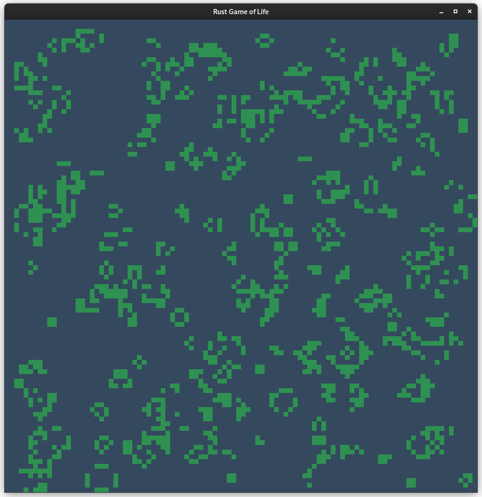

# Rust Game of Life

A game of life written in Rust.



## How To Build It ?

Download Rust compiler from [here](https://www.rust-lang.org/en-US/), change the working directory to the root of this project, then execute the following command:

```
> cargo build
```

The executable binary will appear in `target/debug`, called `rust-game-of-life`.

## Controls

- Use the numpad to reset world with probability 1 - 9 = X*10 % chance the block will be alive at first tick, e.g. 1 = 10 %, 2 = 20 %, ..

## TODOs

- Display stats

## Bugs

- Yes.
